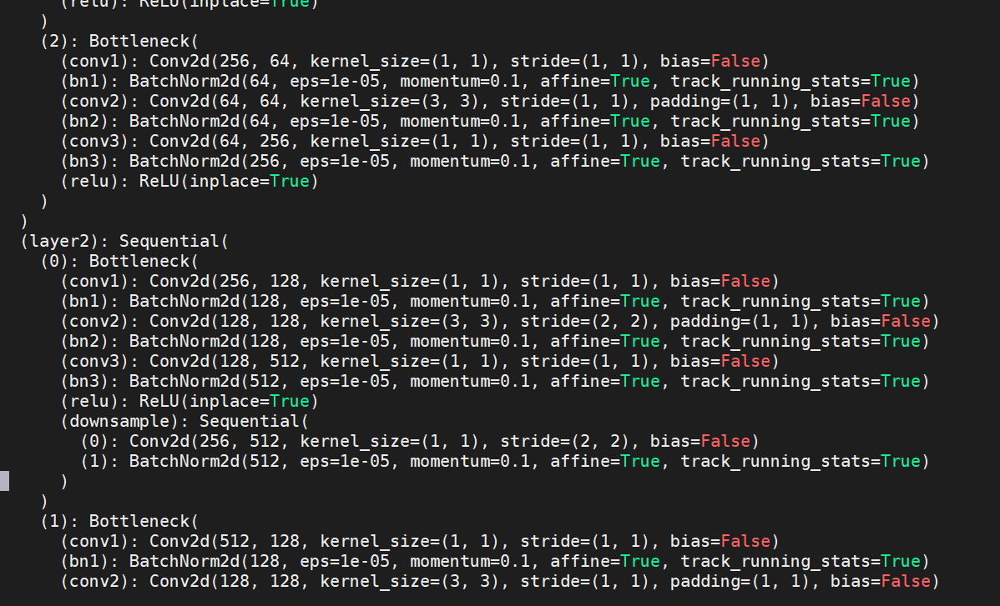

This is structured filter algorithm repoducing for ResNet50 v1.5 in Imagenet 1k based on the CVPR paper [Filter Pruning via Geometric Median
for Deep Convolutional Neural Networks Acceleration](https://openaccess.thecvf.com/content_CVPR_2019/papers/He_Filter_Pruning_via_Geometric_Median_for_Deep_Convolutional_Neural_Networks_CVPR_2019_paper.pdf).

FPGM pruner based on nni (auto_ml tool package) is overwrited, distributed pytorch training is supported. And features like write to tensborboardX is added. 
And after speedup:

With the calculation complexity reduced from 4E9 to 2.7E9 and number of paramters reduced from 25M to 17M which saves nearly half memory usage. The accuracy is 75.6 compared to the orginal one 76.1 within 1% accuracy loss.
The below is pruning added after BN layers and speeduping with pytorch jit trace based on nni pytorch graph trace.

